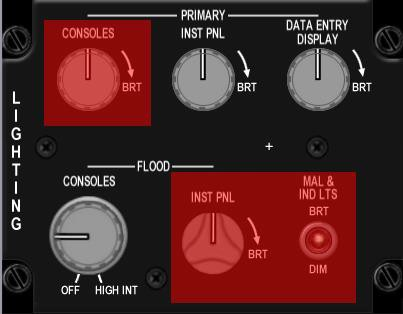

# 1st Sweep: Before starting the engine
Looking towards the back of the left console, 
we start by setting the systems correctly, 
so they begin working from the moment that main generator power is received.
## EXT LIGHTING panel
On the EXT LIGHTING panel we set the 
[]MASTER LIGHT switch to NORM, 
[]ANTI-COLLISION OFF, 
[]POSITION to STEADY and 
[]WING/TAIL & FUSELAGE switch to BRIGHT. 
Note that the WING/TAIL & FUSELAGE switches move together 
as they share a common callback in BMS. 
The FORM and AERIAL REFUELING knobs are not implemented in the current version of BMS.
You won’t immediately see the lights come on as the jet doesn’t have power yet. 
The lights will only come on when the main generator comes online during engine start.

## AUX COMM panel
Moving up we quickly check the AUX COMM panel to check that the 
[]CNI knob is turned to BACKUP. 
We move one step further up and check that the 
[]MASTER FUEL switch on the FUEL panel is positioned to MASTER and that the guard is down. 
These should be correctly set at ramp. The ENG FEED knob though needs to be rotated to NORM 
to avoid fuel system malfunctions later on in the
flight if the fuel pumps are left switched off. The TANK INERTING switch is not implemented in BMS.

## ELEC panel
[]Battery power is enabled with the MAIN PWR switch to BATT on the ELEC panel. 
[]The ELEC SYS caution light and the FLCS RLY, 
[]MAIN GEN and STBY GEN lights (ELEC panel) should come on with battery power enabled. 
We need to test the battery by moving down to the TEST panel

## TEST panel
[]holding the FLCS PWR TEST switch out of NORM to TEST. 
Please note when doing this with the mouse you must 
keep the mouse button depressed on the hotspot 
to simulate holding the switch or button in position. While doing that the 
[]FLCS PMG and the 
[]ACFT BATT TO FLCS lights illuminate and the 
[]FLCS RLY light goes out (ELEC panel). 
[]On the TEST panel the four FLCS PWR lights (ADBC) come on 
indicating good power output to the FLCC. 
[]The MAIN GEN and STBY GEN lights (ELEC panel) remain illuminated during the test.
You can now 
[]release the FLCS PWR TEST switch (release the mouse button). 
The lights reset to their initial state. This check is eye candy and is not mandatory. 
Leave the MAIN PWR switch in BATT for now; we will start the engines after we have finished the pre-start checks.
## AUDIO panel
Let’s set the comms so we’re quickly ready to use the radio after engine start. 
Moving forward to the AUDIO1 panel we 
[]rotate the COMM1 (UHF) volume knob out of OFF clockwise to the 12 o’clock position and 
[]do the same for COMM2 (VHF).

note that the first step out of the full counter-clockwise position actually represents the ON/OFF switch. 
Note also that for the backup UHF panel to work the COMM1 volume on the AUDIO1 panel needs to be out of the OFF position.

The two mode knobs for COMM1&2 should already be set to SQL and do not need to be moved for ramp start. 
They have no function anyway with the CNI switch in the BACKUP position. 
Set the MSL & THREAT volumes to 12 o’clock. 
These two do not have ON/OFF switches at the CCW position but are very often forgotten, 
which may cause problems later if you don’t notice you’ve been locked up or fired upon!

[]The ILS knob needs to be powered for the ILS system to work. 
The ILS audio volume is now implemented and sets the volume of the marker sound. 
Set it as desired. The INTERCOM volume is working as well and controls the level of 
all sounds normally heard in the pilot headset. So this one should always be set to full CW position (default).

## UHF Panel
Moving forward to the backup UHF panel 
[]the left function knob should be rotated from OFF to BOTH and 
[]the right mode knob set to MNL or PRESET or GRD depending on briefing. 

MNL configures the backup UHF panel to use the MANUAL frequency you can now set 
with the 5 smaller knobs. In PRESET the radio is tuned to the selected channel 
(6 by default) and GRD sets the backup UHF to guard UHF (243.000). 
Please note that the F-16 only has a backup radio for UHF and not for VHF. 
The backup UHF radio only works when the CNI switch is in the BACKUP position. 
It is strongly advised to set the backup radio correctly as briefed such that 
your lead or any member of the flight is able to communicate if needed. 
Indeed before switching to CNI the backup UHF radio is your only means of communication. 
In this case, the ground frequency 273.525 might be entered in the manual frequency 
window by clicking the relevant knobs. Once set,

communication with Kunsan ground will be available in Backup mode. 
Select the COM1 page of the UFC; it will display the following page: 
When the UFC will be powered the DED will tell
you that the UHF is ON in Backup mode and 273.525 is selected in 
the MNL window and the active backup preset is channel 6.

## LIGHTING panel
Since there is nothing to set on the front panel during this sweep 
we move straight to the right console. If you need internal lighting 
you can set up the LIGHTING panel accordingly.
[]PRIMARY INST PANEL (backlighting) and 
[]DATA ENTRY DISPLAY (DED and PFD) and 
[]FLOOD CONSOLES (allcockpit floodlights) 
can be rotated clockwise.

The highlighted knobs are not implemented. Please note as the aircraft 
doesn’t yet have main power the lights won’t come on when you move the switch; 
only when the relevant buses receive power.
Note: a spotlight is also available for night ramp starts. 
This is available as soon as the MAIN PWR switch is moved to BATT, 
so for night ramp starts using the MAIN PWR switch key callback, 
followed by the spotlight callback (SHIFT + s) will light up the cockpit, 
allowing you to continue your ramp start more easily.
## COND AIR panel
The next item to check in this sweep is to make sure that 
[]the AIR SOURCE knob is set to NORM. 
Failure to do so will cause an EQUIP HOT caution light as soon as 
the systems are powered by the main generator, because they will not be being cooled correctly.

## ANTI ICE panel
New for 4.35: proceed further aft right and 
[]place the ANTI-ICE switch to ON. 
Yep put it ON and not into AUTO, that is part of the ANTI-ICE TEST sequence.

# 2nd Sweep: Starting engine & systems
The second sweep is dedicated to starting the engine and getting all systems online. 
We start again on the left console.
## ELEC panel   
On the ELEC panel 
[]move the MAIN PWR switch out of BATT to MAIN PWR. 
The lights do not change as the generators need the engine running to provide power to the buses. 
Please note one of the common mistakes is to start the jet in BATT which 
prevents some systems from coming online later as the main generator 
is not online and may cause engine start issues. 
So make sure you start this sweep with the MAIN PWR switch in MAIN PWR.

## CANOPY
Moving forward you can 
[]close the canopy. 
The canopy features a motor switch to lower or raise the canopy and a 
switch guard commonly referred to as the “yellow spider” that locks 
and seals the canopy in place and start the pressurisation.

Both are now functional in BMS. To lower the canopy right click 
on the canopy switch until the canopy is completely lowered. 
Please note. Its downward movement can be stopped at any time 
if the switch is replaced in its centre position.
With the canopy down, you must lock and seal it which is done by 
moving the yellow spider outboard. Once the spider guards the canopy motor switch, 
you will hear the ECS starting and the CANOPY warning light on the right glareshield will extinguish.
## ENG & JET START
[]Ensure the canopy is fully closed before engaging the JFS. 
Closing canopy during JFS operation may result in a failed JFS start 
or premature JFS shutdown due to a reduction in electrical power available to the JFS. 
[]Check your throttle for its correct position (cut-off) 
then move on to the ENG & JET START panel.
[]The JFS switch is moved to START2 with a right-click or START1 with a left- click. 
START1 will one only one JFS/Brake accumulator and provide a 50% chance of engine start. 
START2, normally used in cold weather condition gives a better chance of engine start as it uses both JFS/brake accumulators simultaneously to start the engine. The benefit of using START1 is that in case of failure, 
you have another 50/50 chance of engine start by reusing START1 which will then use 
the remaining JFS/Brake accumulator. In case of depletion of both JFS/Brake accumulators, 
the JFS must be manually recharged (which is possible through the ATC menu)
[]the JFS RUN light comes ON after a few seconds and engine RPM increases steadily to 25%.
[]At that point check that the SEC caution light is off and 
[]move the throttle forward to your IDLE detent (or click the idle detent) and 
monitor lights and engine gauges:

- SEC caution light goes off around 20% RPM (before moving throttle).
- HYD/OIL PRESS light (right eyebrow) goes off between 30 and 35% RPM. 
If the light stays on and your oil pressure remains below 15 psi you have 
an oil pressure fault; shut down the engine immediately
(pull the throttle back to CUTOFF) and follow the steps in 
Dash-1 chapter 3.5.4 GROUND EMERGENCIES to recover from this fault.
- FTIT should increase to around 600-650° then decrease to 500° at idle. 
If you see FTIT rising at an alarming rate or go above 750°C you are encountering a hot start; 
immediately pull the throttle back to CUTOFF and let the FTIT decrease to 200°C while the JFS is running, 
before moving the throttle back to IDLE. See also Dash-1 chapter 3.5.3 GROUND EMERGENCIES for more information on this scenario.
In a good engine start FTIT increases steadily with engine RPM: 40%RPM=400°C FTIT, 
50%RPM=500°C FTIT, ... Experienced pilots can detect a hot start very early as 
the rate of FTIT increase is not proportional to RPM but much faster.
- FLCS PMG light (ELEC panel) goes off around 40-45% RPM.
- JFS shuts off around 55% RPM (the switch automatically snaps back to OFF).
- ENGINE light (right eyebrow) and STBY GEN light (ELEC panel) go off around 
60% RPM and MAIN GEN light (ELEC panel) goes off about ten seconds later.
With the engine running steadily you can check the remaining engine gauges 
such as fuel flow (700-1700 PPH), nozzle position (greater than 94%), 
FTIT (usually below 650°C but never above 800°C), 
HYD A & B pressure (at the 12 o’clock position) and 3 green gear lights.
## TEST panel   
Move back to the TEST panel and 
[]test PROBEHEAT, 
[]FIRE and OHEAT detection and 
[]MAL&IND Lights system.

[]Press and hold the FIRE & OHEAT DETECT button and check the:

- ENG FIRE warning light is on,
- OVERHEAT caution light is on,
- MASTER CAUTION light is on,
- All lights go off when the button is released.

Press and hold the MAL & IND LTS button and check correct operation 
of the Voice Message System (VMS) and that all lights are illuminated. 
If you don’t hear any sounds check the INTERCOM knob.

Flip the PROBE HEAT switch to the upper position and check that the MASTER CAUTION light remains off. 
Move the switch to the lower TEST position and check that PROBE HEAT flashes on the caution panel. 
Once you are satisfied that the system works as advertised you can place the switch to OFF again. 
We will come back later to test the EPU and the oxygen system.

The TEST panel is mostly eye candy and there are no consequences if the above checks are
 skipped although some of these subsystems may now fail in 4.35 (Probeheat)

